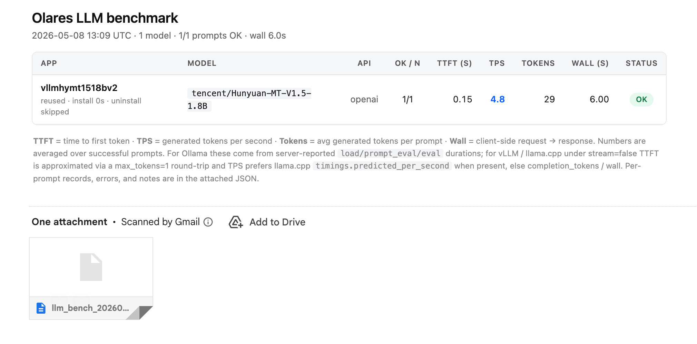

# llm_bench — Olares LLM 基准测试

一个**端到端、可被 cron 触发的 LLM 基准测试脚本**，用来批量评估 Olares 上以 Ollama / vLLM / LLaMA.cpp chart 形式部署的大模型。运行环境基于 Python 3.9+，绝大部分功能直接用标准库（`urllib` / `subprocess` / `smtplib` / `json` 等）；vLLM 的 thinking 探针走官方 `openai` SDK（`pip install -r requirement.txt`，建议先 `python3 -m venv venv && source venv/bin/activate`）。

---

## 它做了什么

对配置文件 `models[]` 里的每一个模型，按下面的流水线**串行**跑一遍（GPU 一次只能装一个，所以必须串行）：

```text
1. ensure_installed         core/lifecycle    检查 chart 状态 → reuse / wait / 重装
2. find_entrance            core/entrance     拿 entrance URL（取不到则用 ports[]+namespace 拼集群内部 URL）
3. ensure_entrance_public   core/entrance     authLevel != public 时自动 flip
4. wait_until_api_ready     core/readiness    ollama: /api/progress→/health；vllm: /cfg→/progress?id→/ping
5. 串行跑 questions[]        core/benchmark    ollama→/api/generate；openai→/v1/chat/completions
6. uninstall                core/lifecycle    默认 uninstall_after_run=true 腾 GPU/磁盘
```

跑完所有模型后：

- `data/report_writer.py` 把所有 `ModelResult` 写到 `output_dir/llm_bench_<timestamp>.json` + `.html`
- `data/mailer.py`（除非加 `--no-email`）通过 SMTP 把 HTML 当邮件正文 + JSON 当附件发给 `email.to`

---

## bundle 就绪流程（核心）

`wait_until_api_ready` 不再轮询 `/api/tags` 或 `/v1/models`。两条 backend 的就绪协议完全独立：

### Ollama 分支（极简：无 /cfg、无 jobId）

1. `GET <entrance>/api/progress`（**直接调，没有 query string**）每 2s 轮询一次，body 是 plain JSON snapshot：
   ```json
   { "app_url": "https://….olares.cn", "status": "completed",
     "model_name": "minicpm-v:8b", "progress": 100, "speed_bps": 1305321903.7,
     "duration": 46, "completed": 0, "completed_at": 1778505406,
     "timestamp": 1778505441, "total": 0 }
   ```
   - 成功终态：`completed` / `success`
   - 失败终态：`error`（抛 RuntimeError 透传 `err`）、`unavailable`（ollama 不可达 或 模型被删）
   - 其它（`starting` / `waiting` / `checking` / `pulling manifest` / `pulling <digest>` / `downloading` / `verifying` / `verifying sha256 digest` / `writing manifest` / `removing any unused layers` / `hashing` / `pushing_blob` / `blob_pushed` / `creating`）→ 打 INFO 进度日志（带原始 JSON body）继续轮询
2. `GET <entrance>/health` 每 2s 轮询 —— **任何 HTTP 2xx 即放行**，不解析 body。chart 还没起 / Authelia 没翻 / 模型还在加载时收到的 400 / 404 / 503 等都打 INFO 带截断的原始 body 然后继续重试。

### vLLM 分支（bundle 协议：/cfg → /progress?id → /ping）

1. `GET <entrance>/cfg` → 两种形态都接受：
   - 单 job：`{ jobId, probeUrl, probeIntervalMs, modelName, repo, ref, appUrl }`（直接用顶层 `jobId`）
   - 多 task：`{ tasks:[{jobId,repo,ref,file,outDir}, ...], jobIds:[...], probeUrl, probeIntervalMs }`（按下面规则匹配）
2. **从配置的 `model_name` 找到对应 task 的 `jobId`**：
   - 顶层有 `jobId` → 直接用，**不做模型名匹配**
   - 仅 1 个 task → 直接用
   - 多 task → 按 `task.repo` / `task.file` / `task.jobId` / `"<repo>/<file>"` 精确匹配 → 大小写不敏感匹配 → 子串匹配（带 WARNING）
   - 都不匹配 → 抛 RuntimeError 并 dump 完整 cfg
3. `GET <entrance>/progress?id=<jobId>` 按 `probeIntervalMs` 轮询。响应是 **SSE 格式**（`data: {json}` 一行一个事件，取最后一个事件作为当前状态）：
   - 成功终态：`done`
   - 失败终态：`error`（抛 RuntimeError 透传 `err`）
   - 其它（`queued` / `running`）→ 打 INFO 进度日志（带原始 JSON body）继续轮询
4. `GET <entrance><probeUrl, 默认 /ping>` 按 `probeIntervalMs` 轮询 —— **任何 HTTP 2xx 即放行**，不解析 body（`pong` / `{}` / `{"status":"ok"}` 都接受）。`probeUrl` 既可以是相对路径，也可以是绝对 URL（自动识别）。
5. 加载完成后一次性 `GET <entrance>/v1/models`，把 `data[0].id` 作为 served name 回填到报告（vLLM 实际 serve 的名字可能跟 HF repo 不一致）。

> 截止时间统一受 `api_ready_timeout_minutes` 控制（默认 60 分钟）。失败重试（transport / 非 2xx / 非 JSON / 非 SSE）固定 5 秒退避，跟成功路径的轮询间隔分开。

---

## 项目布局

```text
benchmark_llm_test/
├── llm_bench.py                     # 入口：argparse + main() + 主循环
├── models.py                        # QuestionResult / ModelResult / OpenAIConfig
├── core/                            # 核心逻辑
│   ├── lifecycle.py                 #   chart 装/卸 + ensure_installed + 状态桶
│   ├── entrance.py                  #   entrance 发现 + auth 翻转
│   ├── readiness.py                 #   wait_until_api_ready（ollama: /api/progress→/health；vllm: /cfg→/progress(SSE)→/ping）
│   ├── orchestrator.py              #   bench_model() 单模型流水线
│   └── benchmark/
│       ├── ollama.py                #     /api/generate（+ spec.thinking=true 时再发一个流式 think:true 探针）
│       └── openai.py                #     /v1/chat/completions + max_tokens=1 TTFT 近似（spec.thinking=true 时改走流式 chat_template_kwargs.thinking 探针，openai SDK）
├── data/                            # 输入输出
│   ├── config.py                    #   load_config + setup_logging
│   ├── html_report.py               #   render_html
│   ├── report_writer.py             #   写 JSON + HTML
│   ├── mailer.py                    #   SMTP（implicit TLS / STARTTLS 自动判断 + 重试）
│   └── probe.py                     #   --probe：只 dump chart env 需求
├── utils/                           # 通用工具
│   ├── cli_runner.py                #   olares-cli subprocess 封装
│   ├── http.py                      #   urllib 封装 + bundle helpers + OpenAIHTTPError
│   ├── format.py                    #   human_bytes + fmt_duration
│   └── tokens.py                    #   rough_token_count + ms_to_seconds
├── config.example.json              # 最小可用样例
├── 2.json                           # 工作配置示例（全模型列表）
├── readme.md                        # 本文
└── cmd.md                           # olares-cli 命令速查
```

---

## 两条 backend 的差异

`api_type` 决定走哪条路径：

| 维度 | `ollama`（默认） | `openai`（vLLM / llama.cpp / 其他 OAI-compat） |
|---|---|---|
| 推理端点 | `/api/generate`（stream=false） | `/v1/chat/completions`（stream=false） |
| 下载进度查询 | `/api/progress`（无 query string，plain JSON snapshot） | `/cfg → /progress?id=<jobId>`（SSE 流） |
| 就绪健康检查 | `/health`，**只看 HTTP 2xx**（body 不解析） | `/cfg.probeUrl` → 默认 `/ping`，**只看 HTTP 2xx** |
| TTFT | server 精确：`load_duration + prompt_eval_duration` | `spec.thinking=true` 时取流式探针的首个 `delta.content`；其它走 `max_tokens=1` round-trip 近似 |
| TPS | server 精确：`eval_count / eval_duration` | llama.cpp 有 `timings` 时用 server TPS；否则 client end-to-end |
| token 数 | server 报 `eval_count` / `prompt_eval_count` | `usage.completion_tokens`；缺失时按字符兜底估算 |
| 采样参数 | 不支持 | `max_tokens` / `temperature` / `top_p` / `extra_body` 等通过 `openai_defaults` + per-model `openai` 块配 |
| Auth 头 | 不发 | `Bearer <api_key>`（默认 `EMPTY` / 空 = 不发，跟 curl 一致） |

---

## 输出指标（每条 prompt 一行 `QuestionResult`）

| 字段 | ollama | openai | 含义 |
|---|---|---|---|
| `wall_seconds` | ✓ | ✓ | 客户端端到端 round-trip |
| `ttft_seconds` | server 精确 | `spec.thinking=true` 时取流式探针的 first-content delta；否则 max_tokens=1 近似 | "思考之后" 的首个回答 token 时间。带 thinking 的模型代表 reasoning trace 结束后开始吐 `content` 的时刻 |
| `thinking_ttft_seconds` | `spec.thinking=true` 时由 `stream=true,think=true` 探针的首个 thinking 块时间填；否则 0 | `spec.thinking=true` 时由 `chat_template_kwargs.thinking=true` 流式探针的首个 `delta.reasoning` / `delta.reasoning_content` 填；否则 0 | "思考中" 第一个 token 时间。`spec.thinking=false` 或探针没拿到 reasoning 块时为 0（邮件里显示 `—`） |
| `has_thinking` | 直接回写 `spec.thinking` | 直接回写 `spec.thinking` | bool，**完全由配置决定**，不做运行时检测。邮件表里聚合成 `Has Think` 列的 `Yes` / `No` |
| `eval_count` | server 报 | `usage.completion_tokens` 或字符估算 | 生成的 token 数 |
| `eval_seconds` | server 报 | llama.cpp `timings.predicted_ms` 才有 | decode 用时 |
| `tps` | server decode-only | server（llama.cpp）或 client（vLLM） | 主要 TPS 指标 |
| `prompt_tokens` / `total_tokens` | 0 | usage 块 | 输入 / 总 token |
| `client_tps` | 同 tps | `eval_count / wall_seconds` | 端到端 TPS（含 prefill+网络） |
| `server_tps_reported` | 0 | llama.cpp `timings.predicted_per_second` | server 自报 TPS |
| `tokens_estimated` | false | true 时表示 token 数是字符估算 | 数据可信度提示 |
| `note` | 短 | 长 | 说明本行哪些指标是近似 |

每个模型聚合成一个 `ModelResult`，HTML 报表里取所有成功 prompt 的平均值。

---

## 运行依赖

1. **olares-cli 已经登录过**：脚本通过 subprocess 调 `olares-cli`，CLI 内部会从 `~/.olares-cli/config.json` 读 profile 元数据 + 从 OS keychain 读 access/refresh token：
   ```bash
   olares-cli profile login --olares-id <id>
   # 或非交互式：
   olares-cli profile import --olares-id <id> --refresh-token <tok>
   ```
   cron 场景注意 `HOME` / macOS keychain unlock 这两个坑，详见 `cmd.md`。
2. **HuggingFace token 已配（vLLM 系列必用）**：
   ```bash
   olares-cli settings advanced env user set --var OLARES_USER_HUGGINGFACE_TOKEN=hf_xxx
   ```
3. **olares-cli 二进制路径可配**：`--cli-path /home/olares/test/olares-cli` 或 config 里 `"cli_path": "..."`，默认从 PATH 找 `olares-cli`。

---

## 配置文件参考

`config.example.json` 是最小可用样例。所有支持字段如下：

### 全局默认（每个 model 可同名字段覆盖）

| 字段 | 默认 | 说明 |
|---|---|---|
| `cli_path` | `olares-cli` | olares-cli 二进制路径。当 cli 装在非常规路径（如 `/home/olares/test/olares-cli`）时在这里指定，或运行时用 `--cli-path` 覆盖 |
| `install_timeout_minutes` | 90 | `market install --watch` 超时（分钟） |
| `uninstall_timeout_minutes` | 30 | `market uninstall --watch` 超时（分钟） |
| `request_timeout_seconds` | 1800 | 单次推理 HTTP 请求超时（秒） |
| `api_ready_timeout_minutes` | 60 | 就绪门最长等多少分钟。覆盖下载 + 模型加载两段。ollama 用固定 2s 轮询 `/api/progress` 和 `/health`；vllm 用服务端 `probeIntervalMs`；任何 backend 的失败重试都是固定 5s |
| `delete_data` | `true` | uninstall 时是否带 `--delete-data` 释放磁盘 |
| `auto_open_internal_entrance` | `true` | entrance 不是 public 时自动调 `auth-level set --level public` + `policy set --default-policy public`。设置 per-app，模型 uninstall 时跟着销毁，所以不会泄漏 |
| `skip_install_if_running` | `true` | 已 running 的 chart 跳过 install |
| `preserve_if_existed` | `false` | true 时仅"跑前已存在"的 chart 跑完不卸载（优先级低于 `uninstall_after_run`） |
| `uninstall_after_run` | `true` | true（默认）：跑完一个模型立刻 uninstall，腾 GPU/磁盘给下一个；false：跑完一律保留。优先级高于 `preserve_if_existed` |
| `cooldown_seconds` | 15 | 模型之间的休眠（秒），让 GPU 显存彻底回收 |
| `output_dir` | config 文件所在目录 | JSON+HTML 报告输出目录，自动创建 |
| `save_pod_logs_on_failure` | `true` | 模型流程失败（install/readiness/benchmark/uninstall 任一阶段报错，或 chart 起来了但所有 prompt 都失败）时，把 `/var/log/pods/*<app_name>*` 这些目录 `tar -czf` 成 `<pod_logs_dir>/<app>_logs_<UTCstamp>.tar.gz`。**uninstall 之前**就归档（uninstall 会把 pod 一并清掉）。归档路径会写进 JSON 的 `pod_logs_archive` 字段，HTML 报表对应行的红色副标题里也会显示 |
| `pod_logs_dir` | `/tmp` | 归档 tarball 的输出目录，自动创建 |
| `sudo_password` | `""` | `/var/log/pods/` 在大多数 Olares 主机上是 root-only。脚本以非 root 跑时填这里：归档会自动改走 `sudo -S tar`（密码经 stdin 注入，**不**进 argv、**不**入日志），完事后 `sudo chown` 把 tarball 物归原主。**安全提示**：这是明文密码，建议把 config 文件 `chmod 600` 并加进 `.gitignore`；若以 root 直接跑或 `/var/log/pods` 已经放开了读权限，留空即可，归档走普通 `tar`。 |
| `thinking` | `false` | 模型带「思考 / reasoning」阶段时设为 true（DeepSeek-R1 / Qwen3 / GPT-OSS / o1-style 这类）：脚本会在每条 prompt 上额外发一个流式探针（ollama 走 `stream=true,think=true` /api/generate；openai 走 `stream=true` /v1/chat/completions + `extra_body.chat_template_kwargs.thinking=true`），只读到第一个 reasoning delta + 第一个 content delta 就主动断开，分别填进 `thinking_ttft_seconds` 和 `ttft_seconds`。**`has_thinking` 直接回写本字段**，邮件 `Has Think` 列也直接由它决定，不做运行时检测 |
| `openai_defaults` | 见下表 | 全局 openai-shape 采样参数 |
| `email` | **必填** | SMTP 配置，见下表 |

### `openai_defaults` 子对象（仅对 `api_type:openai` 生效）

vLLM / LLaMA.cpp / 其他 OpenAI-compatible 后端共用的默认参数。每个 model 可以在 `openai`: {...} 块里 per-model 覆盖。

| 字段 | 默认 | 说明 |
|---|---|---|
| `api_key` | `EMPTY` | llama-server 启了 `--api-key` 时填进来；vLLM / chart 内部不需要可保持 `EMPTY`（脚本会跳过 `Authorization` 头，跟 curl 一致） |
| `endpoint` | `chat` | `chat` 走 `/v1/chat/completions`；`completion` 走 `/v1/completions` |
| `max_tokens` | 256 | 推理生成上限 |
| `temperature` | 0.0 | 采样温度 |
| `top_p` | `null` | nucleus 采样；`null` 表示不发 |
| `extra_headers` | `{}` | 整体合并进请求头 |
| `extra_body` | `{}` | 整体合并进 payload，例如 `{"top_k":50,"repetition_penalty":1.05}` |
| `measure_ttft_approx` | `true` | true 时在每条 prompt 前先测 TTFT：`spec.thinking=true` 走流式探针（首个 `delta.content` → `ttft_seconds`、首个 `delta.reasoning` → `thinking_ttft_seconds`），失败则退到 `max_tokens=1` round-trip；`spec.thinking=false` 直接走 `max_tokens=1`。**false 时整段跳过**：`ttft_seconds=0` |

### `email` 子对象（必填）

Gmail 必须用 App Password（在 Google Account → Security → 2-Step Verification → App passwords 里生成）。配置文件含密码，建议 `chmod 600`。

| 字段 | 默认 | 说明 |
|---|---|---|
| `smtp_host` | — | SMTP 主机名 |
| `smtp_port` | — | 465（implicit TLS）/ 587（STARTTLS） |
| `use_ssl` | `port==465` | 显式覆盖；不写时按端口启发式：465→implicit TLS，其他→STARTTLS |
| `smtp_timeout` | 120 | TCP / TLS 握手超时（秒） |
| `smtp_retries` | 3 | 仅对 transport 错误重试；auth / protocol 错立即抛 |
| `smtp_retry_backoff` | 5 | 退避基数（秒），按 `min(backoff*attempt, 60)` 增长 |
| `username` / `password` | — | SMTP 凭据 |
| `from` / `to` | — | `to` 支持逗号分隔多个收件人 |
| `subject` | `Olares LLM benchmark {date}` | 邮件主题。支持模板占位符 `{date}`（UTC 日期 `YYYY-MM-DD`）、`{datetime}`（`YYYY-MM-DD HH:MM`）、`{stamp}`（与 JSON 文件名一致的 `YYYYMMDD-HHMMSS`）。例 `"Olares LLM benchmark [{stamp}]"` |

### Per-model（最少 2 个字段）

```json
{ "app_name": "ollamadeepseekr114bv2", "model_name": "deepseek-r1:14b" }
```

可选字段：

- `api_type`：`ollama` | `openai`
- `entrance_name`：指定 entrance 名（多 entrance 时挑一个）
- `endpoint_url`：直接覆盖端点 URL，**跳过 entrance 自动发现 + 跳过 auth-level 翻转**。例如 `"http://localhost:30888"`（NodePort）或 `"http://10.x.y.z:8000"`（Pod IP）
- `envs`：数组，原样传给 `olares-cli market install --env KEY=VALUE`
- `openai`：子对象，仅 `api_type:openai` 生效，覆盖 `openai_defaults` 里的任意字段
- 上表「全局默认」中的所有字段（`install_timeout_minutes` / `delete_data` / `auto_open_internal_entrance` / ...）

> ⚠️ `model_name` 跟后端实际加载的模型名只要**互为子串**就算同一个模型（大小写不敏感），不强制一字不差。例如配置 `"Qwen3.5-4B"`、vLLM `/v1/models` 报 `"Qwen/Qwen3.5-4B-AWQ"` —— 视为兼容，保留配置值；只有完全没有子串关系（例如配置 `"qwen3"` vs 实际 `"deepseek-r1:14b"`）时才会自动覆盖成 server-reported 的值。对 vLLM 多 task 的 `/cfg` 还会被 `_find_vllm_task_for_model` 用来在 `tasks[]` 里匹配 `repo` / `file` / `repo/file` 找 jobId（单 task 或顶层 `jobId` 时不参与匹配）。第一次跑前用 `python3 llm_bench.py -c <conf> --probe` 看 chart 声明，或装好后用 `ollama list`(ollama) / `curl URL/v1/models`(vllm 或 llamacpp) 取准确 ID 回填。

### vLLM / llama.cpp 内部 entrance

vLLM / llama.cpp 这类 chart 默认 `authLevel=internal`，没有公网域名。脚本会自动用 `olares-cli settings apps get <app>` 拿到 `ports[] + namespace` 拼出 cluster 内部 URL（`http://<svc>.<ns>:<port>`），从 Olares host 上一般能直接打通。如果你的环境从 host 解不到 cluster DNS：

1. 在该 model 上设置 `endpoint_url` 手动指定 URL；或
2. 保留 `auto_open_internal_entrance:true`（默认）让脚本临时把 entrance 改成 public。

---

## 命令行用法

```bash
# 跑完整流程
python3 llm_bench.py -c config.example.json

# 跑测试，不发邮件
python3 llm_bench.py -c config.example.json --no-email

# 仅 dump 每个 chart 的 env 需求（不安装、不卸载）
python3 llm_bench.py -c config.example.json --probe

# 指定 olares-cli 路径 + 指定日志文件
python3 llm_bench.py -c config.example.json \
  --cli-path /home/olares/test/olares-cli \
  --log /var/log/llm_bench.log

# cron 示例（每天 3:00 跑一遍）
0 3 * * * cd /home/olares/test && \
  /usr/bin/python3 llm_bench.py -c 2.json \
  --cli-path /home/olares/test/olares-cli \
  --log /var/log/llm_bench.log >>/var/log/llm_bench.cron.log 2>&1
```

---

## 嵌入到其他脚本

把项目根目录加到 `sys.path` 之后即可按桶导入：

```python
import sys, pathlib
sys.path.insert(0, str(pathlib.Path("/path/to/benchmark_llm_test")))

from data.config import load_config
from core.orchestrator import bench_model
from models import ModelResult

cfg = load_config("config.example.json")
results: list[ModelResult] = [
    bench_model(spec, cfg["questions"], cfg) for spec in cfg["models"]
]
```

---

## 最终发送邮件效果


